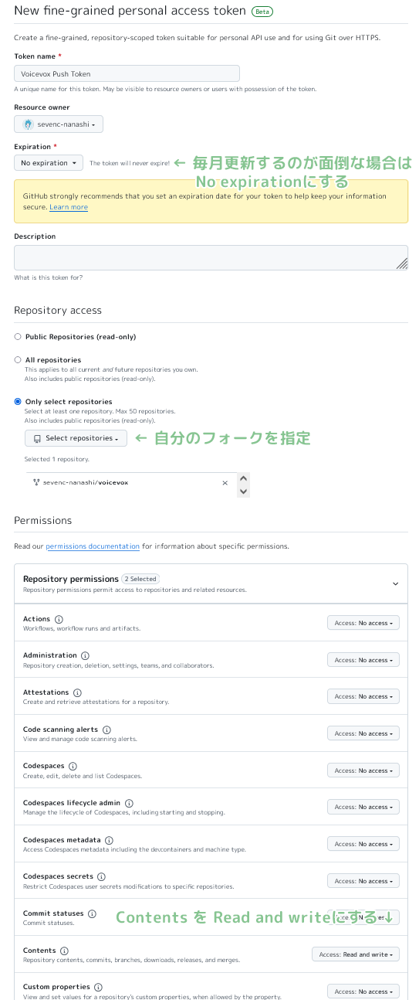

 # VOICEVOX

[](https://github.com/VOICEVOX/voicevox/releases)
[](https://github.com/VOICEVOX/voicevox/actions/workflows/build.yml)
[](https://github.com/VOICEVOX/voicevox/actions/workflows/test.yml)
[](https://discord.gg/WMwWetrzuh)

[VOICEVOX](https://voicevox.hiroshiba.jp/) 的编辑器。

（引擎为 [VOICEVOX ENGINE](https://github.com/VOICEVOX/voicevox_engine/)，  
核心为 [VOICEVOX CORE](https://github.com/VOICEVOX/voicevox_core/)，  
整体结构详情请见[此处](./docs/全体構成.md)。）

## 致用户

这是用于开发的页面。有关使用方法，请访问 [VOICEVOX 官方网站](https://voicevox.hiroshiba.jp/)。

## 致希望为项目贡献的人

VOICEVOX 项目欢迎有兴趣的人参与。  
我们准备了[关于贡献步骤的指南](./CONTRIBUTING.md)。

提到贡献，很多人会想到程序开发，但其实还有文档撰写、测试生成、参与改进提案讨论等多种参与方式。  
我们也为初学者准备了入门任务，期待您的加入。

VOICEVOX 的编辑器使用了 Electron、TypeScript、Vue、Vuex 等技术，整体结构可能较难理解。  
我们通过[代码导览](./docs/コードの歩き方.md)介绍了结构，希望能对开发有所帮助。

在创建解决 Issue 的 Pull Request 时，为了避免与他人重复处理同一个 Issue，  
请在 Issue 页面声明您已开始处理，或先创建一个 Draft Pull Request。

在 [VOICEVOX 非官方 Discord 服务器](https://discord.gg/WMwWetrzuh) 中，我们会进行开发讨论和闲聊，欢迎随时加入。

### 设计指南

请参阅 [UX・UI 设计方针](./docs/UX・UIデザインの方針.md)。

## 环境搭建

请安装 [.node-version](.node-version) 中指定的 Node.js 版本。  
使用 Node.js 管理工具（如 [nvs](https://github.com/jasongin/nvs) 或 [Volta](https://volta.sh)）可以轻松安装并自动切换 Node.js 版本。

安装 Node.js 后，请 Fork [此存储库](https://github.com/VOICEVOX/voicevox.git) 并执行 `git clone`。

### 安装依赖库

通过以下命令安装和更新依赖库：

```bash
npm i -g pnpm # 仅首次需要
pnpm i
```

## 运行

### 准备引擎

复制 `.env.production` 文件并创建 `.env` 文件，  
在 `VITE_DEFAULT_ENGINE_INFOS` 中的 `executionFilePath` 指定 [VOICEVOX 产品版](https://voicevox.hiroshiba.jp/) 中的 `vv-engine/run.exe` 即可运行。

如果您在 Windows 上未更改安装路径，请指定 `C:/Users/(用户名)/AppData/Local/Programs/VOICEVOX/vv-engine/run.exe`。  
注意，路径分隔符需使用 `/` 而非 `\`。

若使用 macOS 的 `VOICEVOX.app`，请指定 `/path/to/VOICEVOX.app/Resources/MacOS/vv-engine/run`。

对于 Linux，请指定从 [Releases](https://github.com/VOICEVOX/voicevox/releases/) 下载的 tar.gz 版中的 `vv-engine/run` 命令。  
若使用 AppImage 版，可通过 `$ /path/to/VOICEVOX.AppImage --appimage-mount` 挂载文件系统。

如果您单独运行了引擎 API 服务器（包括运行产品版 VOICEVOX 的情况），则无需指定 `executionFilePath`，但需将 `executionEnabled` 设置为 `false`。

若需更改引擎 API 的目标端点，请修改 `VITE_DEFAULT_ENGINE_INFOS` 中的 `host`。

### 运行 Electron

```bash
# 在便于开发的模式下运行
pnpm run electron:serve

# 在接近构建时的环境中运行
pnpm run electron:serve --mode production

# 指定参数运行
pnpm run electron:serve -- ...
```

语音合成引擎的存储库在此：<https://github.com/VOICEVOX/voicevox_engine>

### 运行 Storybook

您可以使用 Storybook 进行组件开发。

```bash
pnpm run storybook
```

main 分支的 Storybook 可在 [VOICEVOX/preview-pages](https://github.com/VOICEVOX/preview-pages) 查看：  
<https://voicevox.github.io/preview-pages/preview/branch-main/storybook/index.html>

### 运行浏览器版（开发中）

需单独启动语音合成引擎，然后运行以下命令并访问显示的 localhost：

```bash
pnpm run browser:serve
```

main 分支的构建结果已部署在 [VOICEVOX/preview-pages](https://github.com/VOICEVOX/preview-pages)：  
<https://voicevox.github.io/preview-pages/preview/branch-main/editor/index.html>  
目前需在本地 PC 上启动语音合成引擎。

## 构建

```bash
pnpm run electron:build
```

### 使用 Github Actions 构建

在 Fork 的存储库中启用 Actions，并通过 workflow_dispatch 启动 `build.yml` 即可构建。  
构建产物将上传至 Release。

## 测试

### 单元测试

运行 `./tests/unit/` 下的测试及 Storybook 的测试。

```bash
pnpm run test:unit
pnpm run test-watch:unit # 监控模式
pnpm run test-ui:unit # 显示 Vitest 的 UI
pnpm run test:unit --update # 更新快照
```

> [!NOTE]  
> `./tests/unit` 下的测试会根据文件名在不同环境中运行：  
>
> - `.node.spec.ts`：Node.js 环境  
> - `.browser.spec.ts`：浏览器环境（Chromium）  
> - `.spec.ts`：浏览器环境（happy-dom 模拟）

### 浏览器端到端测试

运行不依赖 Electron 功能的 UI 和语音合成等端到端测试。

> [!NOTE]  
> 部分修改引擎设置的测试仅在 CI（Github Actions）上运行。

```bash
pnpm run test:browser-e2e
pnpm run test-watch:browser-e2e # 监控模式
pnpm run test-watch:browser-e2e --headed # 显示测试中的 UI
pnpm run test-ui:browser-e2e # 显示 Playwright 的 UI
```

因使用 Playwright，可生成测试模式。  
在**浏览器版运行状态下**执行以下命令：

```bash
pnpm exec playwright codegen http://localhost:5173/ --viewport-size=1024,630
```

详情请参阅 [Playwright 文档的 Test generator](https://playwright.dev/docs/codegen-intro)。

### Storybook 的视觉回归测试

比较 Storybook 组件的截图，若有变化则显示差异。

> [!NOTE]  
> 此测试仅在 Windows 上运行。

```bash
pnpm run test:storybook-vrt
pnpm run test-watch:storybook-vrt # 监控模式
pnpm run test-ui:storybook-vrt # 显示 Playwright 的 UI
```

#### 更新截图

浏览器端到端测试和 Storybook 进行视觉回归测试。  
目前 VRT 测试仅在 Windows 上进行。  
可通过以下步骤更新截图：

##### 使用 Github Actions 更新

1. 在 Fork 的存储库设置中启用 GitHub Actions。
2. 在存储库设置的 Actions > General > Workflow permissions 中选择 Read and write permissions。
3. 在提交消息中包含 `[update snapshots]`：

   ```bash
   git commit -m "修改 UI [update snapshots]"
   ```

4. Github Workflow 完成后，更新后的截图将被提交。
5. 拉取后，推送空提交以重新运行测试：

   ```bash
   git commit --allow-empty -m "（重新运行测试）"
   git push
   ```

> [!NOTE]  
> 通过创建令牌并添加到 Secrets，可自动重新运行测试：  
>
> 1. 访问 [Fine-granted Tokens](https://github.com/settings/personal-access-tokens/new)。  
> 2. 输入任意名称，授予 `用户名/voicevox` 的访问权限，并在 Repository permissions 的 Contents 中选择 Read and write。  
>    <details>  
>    <summary>设置示例</summary>  
>      
>    </details>  
> 3. 创建令牌并复制字符串。  
> 4. 在 `用户名/voicevox` 的存储库 Settings > Secrets and variables > Actions > New repository secret 中，  
>    输入名称 `PUSH_TOKEN`，粘贴令牌字符串并添加 Secrets。

##### 本地更新

仅更新本地 PC 的操作系统支持的截图：

```bash
pnpm run test:browser-e2e --update-snapshots
```

### Electron 端到端测试

运行需要 Electron 功能的测试，包括引擎启动和关闭等。

```bash
pnpm run test:electron-e2e
pnpm run test-watch:electron-e2e # 监控模式
```

## 生成依赖库的许可证信息

依赖库的许可证信息在 Github Workflow 构建时自动生成。可通过以下命令生成：

```bash
# 从 voicevox_engine 获取 licenses.json 作为 engine_licenses.json

pnpm run license:generate -o voicevox_licenses.json
pnpm run license:merge -o public/licenses.json -i engine_licenses.json -i voicevox_licenses.json
```

## 代码格式化

格式化代码，请在提交 Pull Request 前运行：

```bash
pnpm run fmt
```

## 静态分析（Lint）

进行代码静态分析，以防潜在错误。请在提交 Pull Request 前运行：

```bash
pnpm run lint
```

## 拼写检查

使用 [typos](https://github.com/crate-ci/typos) 进行拼写检查：

```bash
pnpm run typos
```

如有误判或需排除检查的文件，请根据[设置文件说明](https://github.com/crate-ci/typos#false-positives)编辑 `_typos.toml`。

## 类型检查

进行 TypeScript 类型检查：

```bash
pnpm run typecheck
```

## Markdownlint

检查 Markdown 语法：

```bash
pnpm run markdownlint
```

## Shellcheck

检查 ShellScript 语法。安装方法请参阅[此处](https://github.com/koalaman/shellcheck#installing)：

```bash
shellcheck ./build/*.sh
```

## OpenAPI 生成器

在语音合成引擎运行状态下执行以下命令：

```bash
curl http://127.0.0.1:50021/openapi.json >openapi.json

pnpm exec openapi-generator-cli generate \
    -i openapi.json \
    -g typescript-fetch \
    -o src/openapi/ \
    --additional-properties "modelPropertyNaming=camelCase,supportsES6=true,withInterfaces=true,typescriptThreePlus=true"

pnpm run fmt
```

### OpenAPI 生成器版本升级

检查和安装新版本：

```bash
pnpm exec openapi-generator-cli version-manager list
```

## 在 VS Code 中调试运行

在 `serve` 或 `electron:serve` 等开发构建下，vite 会输出 sourcemap，以关联源代码和生成代码。

通过复制 `.vscode/launch.template.json` 为 `.vscode/launch.json`，  
复制 `.vscode/tasks.template.json` 为 `.vscode/tasks.json`，  
即可启用从 VS Code 运行和调试开发构建的任务。

## 许可证

采用 LGPL v3 和无需公开源代码的另一种许可证的双重许可。  
如需获取另一种许可证，请联系 Hiroshiba。  
X 账户：[@hiho_karuta](https://x.com/hiho_karuta)

