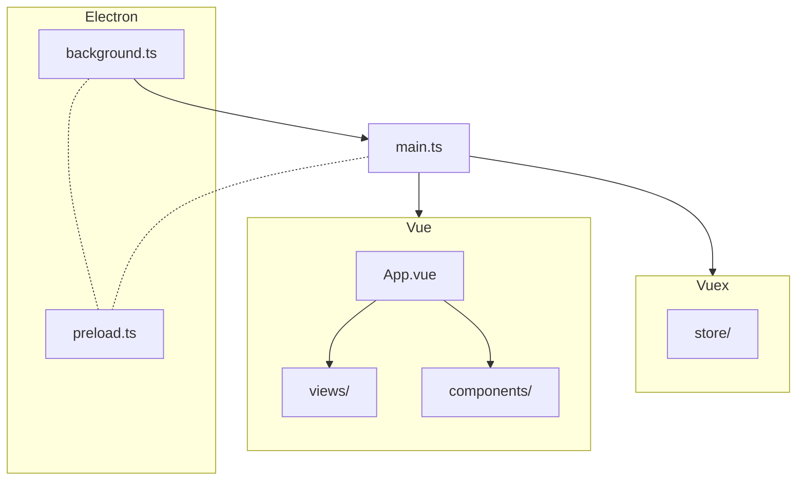
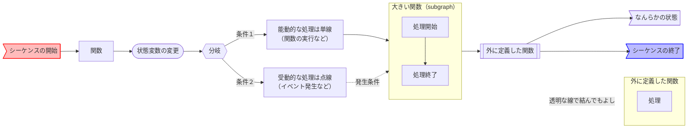

 # VOICEVOX 编辑器代码走查

VOICEVOX 的编辑器使用了 Electron、TypeScript、Vue、Vuex 等技术，因此整体结构可能会显得有些难以理解。在这里，我们将介绍其整体架构，希望对你阅读代码有所帮助。

## 代码执行顺序

为了帮助那些想要快速阅读代码的人，下面简洁地说明了代码执行的顺序。由于优先考虑简洁性，某些表述可能不够准确，请注意。

1. Electron 启动应用程序。此时执行的代码是 `src/background.ts`。
2. 从 `src/background.ts` 启动用于显示 UI 的窗口。此时执行的代码是 `src/main.ts`。
3. `main.ts` 使用 Vue 渲染 UI。UI 的根组件是 `src/App.vue`。
4. `src/App.vue` 调用不同的 UI 组件。UI 组件分别位于 `src/views` 和 `src/components` 目录中。
5. 在 UI 渲染的同时，管理应用程序状态和逻辑的 Vuex 存储会被初始化。Vuex 的相关代码位于 `src/store` 目录中。
6. 所有这些代码都是用 TypeScript 编写的。Vue 和 TypeScript 代码会在运行和构建时自动转换成 JavaScript。

此外，Electron 会加载预加载脚本 `src/electron/preload.ts`，以便在主进程（启动时执行的进程）和渲染进程（用于显示 UI 的进程）之间进行通信。

## 设计

以下是 Electron、Vuex 和 UI 部分的设计方针简述。

### Electron 相关（`src/electron/`）

TODO

### Vuex 相关（`src/store/`）

在 VOICEVOX 中，动态变化的状态以及修改状态的函数通过 Vuex 的 `Store` 来进行管理。`Store` 按照不同的目的（音频、引擎、UI 等）进行了分割，并在 `src/store/index.ts` 中进行了集成。

简单介绍一下 Vuex 的规格：
- 状态保存在 `State` 中，状态的修改通过 `Mutation` 来实现。
- `Mutation` 必须同步执行，如果需要进行异步操作，则需要使用 `Action`。
- 在 VOICEVOX 内，所有 UI 操作都通过 `Action` 执行，并由 `Action` 内部触发 `Mutation`。这种设计是为了后文提到的 Undo/Redo 机制。
- 所有函数都以字符串形式传递，这是 Vuex 的规范。在追踪代码时，可以通过全局搜索这些字符串来查找相关部分。

由于 Vuex 的类型支持较弱，VOICEVOX 为了增强类型支持，额外创建了类型机制（见 `src/store/type.ts`）。如果要定义函数，首先需要在 `type.ts` 中声明类型，然后在对应的 `Store` 内实现。

为了确保从 UI 访问 Electron 或引擎时能集中管理状态变化，VOICEVOX 确保所有这些访问都必须通过 Vuex。这是继承 Flux 思想的一部分，旨在减少外部访问所引起的状态变化的不确定性。

VOICEVOX 的 Undo/Redo 机制是通过包装 Vuex 的 `Mutation` 实现的。当状态从 A 变更到 B 时，自动将 A→B 的变更添加到 Undo 栈中。详细信息请参阅 [Undo/Redo 实现 #116](https://github.com/VOICEVOX/voicevox/issues/116)。

### UI 相关（`src/views/`、`src/components/`）

TODO

## 源代码目录结构

- `src`
  - `background.ts` ･･･ Electron 版应用启动时执行的代码，负责显示窗口和启动引擎等。Electron 的主进程。
  - `main.ts` ･･･ 用于显示窗口时首先执行的代码，在此集成了 Vue 和 Vuex。
  - `App.vue` ･･･ Vue 的根组件，所有其他组件的父组件。
  - `views` 目录 ･･･ 用于覆盖整个界面的 Vue 组件。
  - `components` 目录 ･･･ 用于 UI 部件的 Vue 组件。
    - 关于具体的 UI 组件与 Vue 文件名的对应关系，可以参考 [UI 名称和 Vue 文件名的对照表](UI名称とVueファイル名の対応早見表.md)。
  - `store` 目录 ･･･ Vuex 的存储目录，应用的大部分逻辑在这里实现。
  - `electron` 目录 ･･･ 存放与 Electron 的 ipc 通信相关的代码。
  - `browser` 目录 ･･･ WIP（进行中的工作）。
  - `type` 目录 ･･･ 存放 TypeScript 的类型定义文件等。
  - `styles` 目录 ･･･ 存放 CSS 和 SCSS 文件等。
  - `infrastructures` 目录 ･･･ 用于跨越 UI 和其他代码的目录，适用于需要额外层次结构时的代码。
  - `openapi` 目录 ･･･ 用于调用引擎 API 的代码目录，通过 OpenAPI 自动生成。
  - `helpers` 目录 ･･･ 存放实用函数的目录。
  - `shared` 目录 ･･･ 存放 UI 和 Electron 两者都能引用的代码。
- `public`
  - 存放应用资源文件的目录。
- `build`
  - 存放构建所需文件的目录。

## 时序图

- [启动时序图](res/起動シーケンス図.md)
- [退出时序图](res/終了シーケンス図.md)
- [引擎重启时序图](res/エンジン再起動シーケンス図.md)

使用 [Mermaid Flow](https://www.mermaidflow.app/) 编写，mermaid 代码可以直接粘贴到网站进行再编辑。相关语法规则请参考如下：

处理前缀列表：

- back: `background.ts` 的函数
- app: `app` 的事件
- win: `win` 的事件
- engine: `EngineManager` 的方法
- store: `electron-store` 的方法
- Vuex: `Vuex` 的函数

