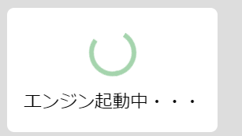

 <xaiArtifact artifact_id="cda6ebac-f8be-447a-b601-86e2d9f60df4" artifact_version_id="09a9d80f-4d2b-45ff-99d9-9022836298d7" title="VOICEVOX_Usage_Guide_zh-CN.md" contentType="text/markdown">

# 使用指南

## 引言

大家好！我是你的“语音合成小助手”，今天要带你玩转文本语音合成软件 **VOICEVOX**！😎 这篇指南会用最通俗的语言，手把手教你怎么用这个神器把文字变成超自然的声音。  
在开始之前，记得先瞅一眼[使用条款](https://voicevox.hiroshiba.jp/term)，别一不小心踩了雷哦！⚡️  

另外，官方还贴心地准备了个[轻松入门视频](https://youtu.be/4yVpklclxwU)，想偷懒的朋友可以先看看，绝对比我讲得还生动！😉

## 安装与启动

### Windows 版

<details><summary>点击展开</summary>

启动 VOICEVOX 时，Windows 可能会跳出个“你的 PC 被保护了”的警告窗口，别慌！  
这时候，点一下“详细信息”，确认发行商是“Kazuyuki Hiroshiba”，然后大胆点“运行”就行！  

 → 

</details>

### Mac 版

<details><summary>点击展开</summary>

第一次启动时，Mac 可能会因为 VOICEVOX 不是 Apple 注册的应用而弹个警告。  


别急，解决办法有两种：  
1. 在 Finder 中，按住 `Ctrl` 键点击 VOICEVOX 应用图标，从快捷菜单选“打开”，然后再点“打开”。  
2. 或者，打开苹果菜单，进入“系统设置” → “隐私与安全”，在页面底部找到“仍要打开”，点它就行。  


如果你用的是 macOS Ventura 之前的版本，流程稍有不同：  
苹果菜单 → “系统偏好设置” → “安全与隐私” → “通用”面板，选“仍要打开”。  


#### 用 Apple Silicon 的 Mac 的朋友注意啦！

初次启动 VOICEVOX 时，系统可能会提示安装 Rosetta，按提示装就行，简单得很！  


</details>

## 启动语音合成引擎

软件一启动，语音合成引擎会先“热身”。  
如果你有 GPU，那恭喜你！可以用 GPU 模式，生成语音的速度快到飞起！🚀  
*（小提醒：Mac 版暂时不支持 GPU 模式，CPU 也够用了！）*  



## 生成与播放语音

好了，重头戏来了！在角色图标旁边的空白处点一下，输入你想让角色说的话。  


输入完，按下 `Enter` 键，屏幕下方会显示读音和重音。（第一次可能要等几秒，别急！）  


点播放按钮，语音就生成并播放了，超简单吧！😄

## 添加与删除文本

想多说几句话？右下角的“+”按钮点一下，就能再加个文本框，轻松排好多句！  


不想要某个文本框了？把鼠标移到文本框上，点出现的垃圾桶按钮，删掉它！  

## 更换角色

想换个角色配音？点文本框左边的角色图标，就能挑其他“声优”来读你的文本。  


角色的显示顺序可以在“角色排序”里调整，随你喜欢！  

## 文本框排序

拖动文本框周围的区域，就能把文本框的顺序调来调去，灵活得很！  

## 词语连接调整

有时候，软件会把词分得不好，比如“深度学习”被拆成“深度”和“学习”。别慌！在重音栏点一下文字间的空隙，就能修正。  

比如：  


点一下空隙：  


就能合起来：  


想拆开词？反过来点一下空隙就行！  


## 重音调整

如果语音的语调不太对，有两种方法搞定，推荐先试调整重音。  

在读音上方的横条左右拖动，就能改重音位置。比如想让“深度学习”读成“↑ 深度 ↓ 学习”，就把圆点滑到“学”上。  

 → 

## 参数调整

屏幕右边有个参数栏，可以给每个文本框单独调说话速度、音高啥的。  


- **说话速度**：数值越大，读得越快，像打了鸡血！  
- **音高**：数值越大，声音越高，像小黄鸭！  
- **抑扬**：数值越小，越像机器人“棒读”。  
- **音量**：数值越大，声音越响，震你耳朵！  
- **间距**：调整句中无声部分的长度，数值越大，停顿越长。  
- **开头/结尾无声**：调整语音首尾的沉默时间，数值越大，安静时间越长。  

## 语调调整

重音调不好使，或者你想更精细地控制语调？点“语调”，拖动出现的纵条，就能直接改每个字的音高。  


想调得更细？把语调调整区域拉高点，空间更大，调起来更爽！  


鼠标滚轮也能调，配合 `Ctrl` 键（Mac 用 `Command`）可以更精细。按住 `Alt` 键（Mac 用 `Option`）调整语调或长度时，能同时改整个重音区间。  

如果“キ”“ツ”“ス”这些音被消音（灰色条），点一下语调栏的文字就能解除消音。  

 → 

*小贴士*：只有“イ”行和“ウ”行的音可以消音哦！  

## 读音修正

读音不对？在重音栏点文字，就能改读音，支持平假名、句读、汉字随便输！  


改完读音，其他调整（比如语调）不会丢，超方便！  

## 风格切换

有些角色有多种“说话风格”，跟换角色一样，点文本框左边的图标就能选。  


默认风格可以在设置的“默认风格”里改。  

## 音长调整

想让某个音拖长点？点“长度”，拖动纵条，往上拉音变长，往下拉变短。右边条是元音，左边是辅音。  


## 从中间开始播放

点一下重音区间，就能从那段开始播放语音，再点一下取消。  


## 导出音频文件

在菜单“文件” → “音频导出”，就能把所有文本框的语音导出为 WAV 文件。文件名默认是 `[行号]_[角色名]_[文本开头].wav`，还可以在设置里选导出文本文件。文件名格式也能在“导出文件名模式”里自定义。  

## 导入文本文件

点导入按钮，就能读入文本文件。文本用换行或半角逗号（,）分隔，还能指定角色名，比如：  

```txt
四国めたん,おはようございます,こんにちは
ずんだもん,こんばんは
四国めたん（あまあま）,さようなら
```

导入后是这样的：  


没指定风格时，用默认风格。  

## 合并导出文本

菜单“文件” → “合并导出文本”，能把所有文本连角色名一起导出，方便下次用“导入文本”加载。  

## 保存与加载项目文件

输入的文本、角色、重音、语调等调整都能保存成项目文件（扩展名 `.vvproj`），下次启动软件直接加载，继续干！  

## 快捷键

在“设置” → “快捷键分配”里能看和改快捷键。（Mac 用户把 `Ctrl` 换成 `Command`，`Alt` 换成 `Option`）  

- **上下键**：切换上下文本框  
- **空格**：播放语音  
- **Shift + Enter**：新增文本框  
- **Shift + Delete**：删除文本框  
- **Ctrl + S**：保存项目  
- **Ctrl + E**：导出音频  
- **Ctrl + Z**：撤销  
- **Ctrl + Y**：重做  
- **Esc**：取消文本框焦点  
- **1**：显示重音栏  
- **2**：显示语调栏  
- **3**：显示长度栏  
- **鼠标滚轮（在滑块上）**：调整滑块值（滑块 → ）  
  - 按 `Ctrl` + 滚轮：更精细调整  
  - 按 `Alt` + 调整语调/长度：同时改整个重音区间  
- **Ctrl + G**：重置全部语调  
- **R**：重置选中的语调  
- **Ctrl + 数字**：选第几个角色  

## 自定义工具栏

拖动按钮，就能改顶部工具栏的按钮类型和顺序，随你心情！  


## 角色排序与试听

在“设置” → “角色排序”，能调整角色显示顺序，还能试听每个角色的样本语音，挑个最爱的！  

## 默认风格

在“设置” → “默认风格”，能改每个角色的默认说话风格。  

## 读音与重音字典

遇到难读的词或新词读不对？用字典功能搞定！在“设置” → “读音与重音字典”里操作。  

打开字典，左边是已注册的词列表，点“添加”就能加新词。  


在“单词”填要注册的文本，“读音”填平假名或片假名读法，“重音调整”调自然的重音。如果词没生效，试试调高“单词优先级”。  


## 歌曲功能

VOICEVOX 还有个超酷的歌声合成功能（原型版），有两种模式：  


- **哼唱**：用角色说话的声音唱歌，超有个性！  
- **歌曲**：更像专业歌手的声音，唱起来带感！  

这功能还在开发中，欢迎甩反馈给官方！  

### 添加音符

点一下钢琴卷帘，就能加个指定音高的音符。拖动还能一边指定长度一边加。按 `Esc` 取消选中。  

### 输入歌词

双击音符就能输入歌词，输多个字会自动分配到后面的音符。  


### 音域调整

“音域调整”数值越大，音越高；越小，音越低。默认值已经适配角色音域，关系大概是：  

| 音域调整值 | 中心音 |
|------------|--------|
| 0          | G4（ソ4） |
| -7         | C4（ド4） |
| -12        | G3（ソ3） |
| -19        | C3（ド3） |
| -24        | G2（ソ2） |

### 声量调整

如果声音有点沙哑，调“声量调整”到 5 或 10，能让发声更清晰。未来这值会自动优化。  

### 音高编辑

切换到音高编辑模式，就能精细控制歌的音高，唱出你的风格！  

### 导入

支持导入各种格式的项目文件，超方便！  

### 多轨编辑

点左上角的汉堡菜单 ☰，打开轨道列表，点“+”加新轨道，就能编辑和播放多轨内容。  

### 歌曲功能常见问题

**问：音符变红，播不了声？**  
答：这是错误提示。当前版本一个音符只能输入一个日文字符，音符重叠也会报错。  

**问：音高不对？**  
答：可能音域没调好，试试调整“音域调整”。  

## 选项设置

在“设置” → “选项”里能改各种功能：  

### “引擎”设置

- **启动模式**：有 GPU 的朋友可以用 GPU 模式（Linux 只支持 Nvidia GPU）。  
- **采样率**：改音频采样率，调高不会提升音质哦。  

### “操作”设置

- **预设功能**：把说话速度、抑扬等参数存成预设，软件重启也能用。还能批量改用同一预设的文本框参数。每个风格有默认预设。  
- **风格切换时用默认预设**：开预设功能后，换风格自动用默认预设。  
- **参数继承**：新增文本框时，继承之前文本框的参数。  
- **播放位置跟随**：播放时自动滚动，让当前单词留在屏幕内。  
- **文本自动分割**：粘贴文本时，用句号或换行自动分段。  
- **备注功能**：用 `[]` 或 `［］` 写备注，方便记笔记。  
- **注音功能**：用 `{目标词|读音}` 或 `｛目标词｜读音｝` 指定读音，改读音不改文本。  

### “保存”设置

- **固定导出路径**：每次导出音频到同一文件夹，省得老选。  
- **文件名模式**：自定义导出音频或文本的文件名格式。  
- **防止覆盖**：同名文件自动加序号保存。  
- **字符编码**：选读写文件的编码。  
- **导出 txt**：连文本内容一起保存。  
- **导出 lab**：保存音素和时序的标签文件，适合唇形同步。  

### “外观”设置

- **主题**：切换亮色或暗色主题。  
- **字体**：改软件字体。  
- **显示行号**：文本框左边显示行号。  
- **隐藏添加按钮**：隐藏文本添加按钮，用 `Shift + Enter` 代替。  

### “高级设置”

- **多引擎功能**：用 VOICEVOX API 兼容引擎，开启后在“引擎” → “引擎管理”里装 VVPP 文件或指定引擎路径。  
- **立体声**：把单声道转立体声播放或保存。  
- **播放设备**：选音频播放设备。  

### “实验功能”

- **疑问句自动调整**：疑问句自动抬高语尾，生成更自然的问句语调。  
- **声音融合**：混合同步音声生成新音色，需先生成两段音声再处理。  
- **多选文本框**：按 `Shift` + 点击选连续文本框，`Ctrl` + 点击选单个文本框。  

### “数据收集”

- **允许收集使用数据**：发送 UI 使用率等数据，帮 VOICEVOX 改进。放心，文本和音频数据不收集！  

## 其他

右上角的图钉按钮能把窗口固定在最前面，超实用！  

## 帮助

想看使用条款等内容？点“帮助”菜单就行。  

## 卸载方法

### Windows 版

- **安装版**：运行安装文件夹里的 `Uninstall VOICEVOX.exe`。  
- **ZIP 版**：删掉下载的 ZIP 文件和解压后的文件夹就行。  

### Mac 版

- **安装版**：把“应用程序”文件夹里的 VOICEVOX 拖到“废纸篓”。  
- **ZIP 版**：删掉 ZIP 文件和解压文件夹。  

用多引擎功能加了引擎？在 Finder 点“前往” → “前往文件夹”，输入 `~/Library/Application Support/voicevox`，删掉 `vvpp-engines` 文件夹。  

## 常见问题

查阅 [Q&A](https://voicevox.hiroshiba.jp/qa)，答案全在这！  

## 反馈、建议与 bug 报告

有啥想法或建议？快去 X（原 Twitter）带上 `#VOICEVOX` 标签发帖，开发者等着你的鼓励呢！😄  

遇到 bug 或软件不听话？带上 `#VOICEVOX` 标签发帖，或者直接联系官方账号 [@voicevox_pj](https://x.com/voicevox_pj)。其他问题也可以找他们！  

</xaiArtifact>

